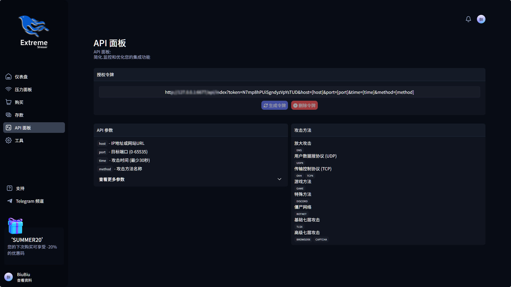

# Stresser-Testplatform
一站式网络压力测试发起平台源码，（Layer7/Layer4）| 简单 · 稳健 · 可视化

让压力测试像打开开关一样轻松。集成前后台管理、会员体系与可视化分析，助你合法评估自有网站与服务器的抗压能力。

关键词："网络压力测试, DDoS 测试, Layer4/Layer7, 高并发测试, 压力测试平台, 网站安全测试, 会员管理, API 接口, 可视化统计, 企业级工具, CC，绕过，cdnfly绕过, CloudFlare绕过, API 发起, 集群, LeCDN绕过, Safeline绕过, Goedge绕过, 极验绕过, FlexCDN绕过, Aliyun绕过"

---

## 核心卖点
- 多协议压力测试：支持 UDP/TCP/AMP 与 HTTP/HTTPS
- 智能方法与节点调度：自动匹配可用资源，稳定输出
- 可视化大屏：方法占比、网络负载、今日数据一目了然
- 会员/套餐/附加包：灵活配置，按需扩展
- Token API：程序化调用测试与快捷集成

## 安全与合规
- 内置轻量 WAF 与黑名单拦截，安全可控
- Turnstile/Referer 校验与输入清洗，防滥用
- 仅限合法授权场景的压力评估使用

## 适用场景
- 上线前性能压测与容量规划
- 业务高峰前的承载验证
- 定期安全演练与压测复盘

---

## 详细功能一览
- 支持用户注册/登录（集成 Cloudflare Turnstile 验证）
- 会员套餐（plans）与到期时间管理（planexpire）
- Premium/Free 判定、API 权限叠加（用户级 + 套餐级）
- 附加包（Addons）：额外并发数、时长追加
- 封禁/解封与黑名单判定

### 【方法与服务器池管理】
- 方法库（methods）：支持 AMP、UDP、TCP、GAME、SPECIAL、BOTNET、BASICL7、PREMIUML7、FREEL4、FREEL7 等类型 自定义
- 服务器池（servers）：按方法匹配、随机挑选可用节点，基于 slots 做并发/容量校验
- 动态替换 API 模板变量：[host]、[port]、[time]、[method] 等 自定义
- 使用统计：每次发起会累加 usageStats，便于运营分析

### 【压力发起（面板端）】
- L4：目标 IP + 端口 + 时长 + 方法 + 并发，严格的数值校验与黑名单校验
- L7：URL + 时长 + 方法 + 请求方式（GET/POST/HEAD）+ 每 IP 请求速率 + 并发
- 实时校验：最小时长、最大时长（受套餐/附加包限制）、并发上限、方法类型与套餐匹配
- 运行中任务表格（DataTables）：可视化查看发起任务

### 【REST API（程序化调用）】
- Token API：GET 方式传参，支持 L4/L7 参数（req_method、reqs、httpversion、referrer、cookies、geoloc 等）
- 支持 stop / stopall 操作（按目标或全部）
- 严格校验：Token 绑定用户、套餐与 Premium 校验、参数格式校验、黑名单校验、并发与时长约束

### 【日志与可视化】
- attacklogs：记录用户、目标、端口、方法、并发、开始/结束时间、是否停止、API/面板来源等
- Dashboard 图表：方法使用占比、网络负载实时图、今日/进行中/用户总数等统计
- 支付列表、工单列表、公告列表等均支持 DataTables 服务器端分页

### 【黑名单与合规】
- 黑名单（blacklist）：支持按 IP/域名/URL 维度拦截目标
- 前台展示 TOS/版权声明页面，强调仅用于合法的自有资产压力测试

### 【安全性】
- 内置轻量 WAF（aWAF）：
  - 检查 GET/POST/COOKIE 的 XSS/SQL 关键字
  - HTML 注入检测、简单内容净化
  - 防 Cookie 劫持：Session 绑定来访 IP 头
  - Cloudflare IP 透传（HTTP_CF_CONNECTING_IP）支持
- 表单与接口安全：Referer 检测、基础 CSRF Token 辅助（生成/校验）、输入清洗与类型校验

### 【支付与订单】
- 支付创建/取消/查询 REST 接口
- Sellix Webhook 集成（/dash/rest/webhooks/sellixhook.php）
- 套餐/附加包购买流程：计划查询、下单、支付回调记账

### 【客服与公告】
- 工单系统：创建/回复/关闭/查看，支持 Admin 审核处理
- 公告/新闻：前台展示，后台增删改

### 【运维与定时任务】
- 计划任务：schedule.php 自动触发 sheduledattacks 中到期但未开始的任务
- 到期清理：expiration.php 定期重置已过期会员的权限、附加包与 API Token

### 【工具与增强功能】
- 端口扫描工具（portScanner）
- API 代理：
  - FiveM 服务器查询（cfx.re join 链接 → 名称/IP/人数/资源统计）
  - DNS 解析代理（解析域名 A 记录）

### 【后台运营面板（Admin/Support）】
- 方法管理：新增/修改/删除、是否 Premium、时长限制、类型分类
- 服务器管理：新增/修改/删除、slots 容量、可用状态、支持方法匹配
- 用户管理：查询/更新/封禁/解禁、查看攻击记录
- 计划与附加包：创建/调整/删除、倍率增减
- 黑名单管理：增删改查
- 日志管理：攻击日志检索与清理
- 支付/订单：记录查看与校验
- 快捷控制：全局 stop/stopall（管理端）

### 【前台与用户端界面】
- 公共站点首页（SEO 优化、内容模块化、动画与动效）
- 登录/注册页（Turnstile 验证）
- 用户仪表盘：
  - 首页（服务器状态/方法占比/实时网络负载/公告）
  - 压力面板（L4/L7 发起）
  - 购买/充值/个人资料/工具/工单等

---

## 技术栈与架构
- 后端：PHP + MySQL（PDO，严格错误处理与异常）
- 前端：jQuery、DataTables、Tailwind CSS、Flowbite、AOS、Alpine.js、noUiSlider
- 网络与集成：cURL 调度外部节点 API、Cloudflare Turnstile、Google DNS API、Sellix Webhook
- 安全：自研轻量 WAF（aWAF）、输入校验、Referer 校验、简要 CSRF 机制、Session/IP 绑定
- 缓存：文件缓存（/cache/*.cache）
- 目录结构：
  - backend/configuration：数据库连接、WAF、公共函数、到期清理、调度等
  - frontend：公共站点、登录注册、错误页、静态资源
  - frontend/dash：用户仪表盘、Admin/Support 子面板、REST API 集合

---

## 适用场景
- 自有业务/资产的抗压能力评估与容量规划
- 多方法、多节点的压力策略编排与执行
- 需要可视化与可运营化的“压力测试 + 会员/支付/客服”一体化平台

---

## 售后与支持
- 通过站内工单系统获取支持

---

## 合法合规声明
- 本项目仅用于合法授权的压力测试与教学/研究用途，不得用于任何未授权的攻击或破坏活动。使用方需自行确保目标为自有或已获得书面授权的资产，并遵守当地法律法规与服务条款。

## 相关联系
 - [Telegram: https://t.me/U_BiuBiu](https://t.me/U_BiuBiu)
